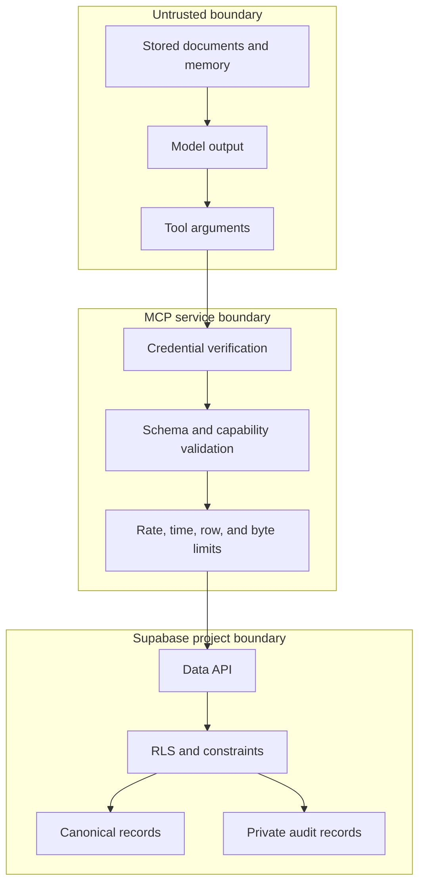

# Architecture

- **Status:** Mixed — local foundation implemented; remote and write profiles proposed or blocked
- **Last reviewed:** 2026-09-02

Implemented behavior is linked through the [evidence index](evidence/README.md). Target
components and profiles remain design requirements until their named acceptance gates pass.

## Context

The project sits between an untrusted-or-partially-trusted AI client and sensitive
application data. Its purpose is to preserve an identity and capability boundary, not to
replace Postgres authorization with application code.

Supabase Auth users are not individual Postgres roles. PostgREST uses shared database
roles and provides verified request claims to Postgres, where `auth.uid()` and
`auth.jwt()` can participate in RLS decisions. The design must preserve an equivalent
verified context for every data operation.

## Logical architecture

```mermaid
flowchart LR
    Client["MCP client\nuser or agent"]
    Transport["MCP transport boundary\nstdio or remote HTTP"]
    Auth["Identity verifier\nissuer, audience, expiry, client"]
    Registry["Tool registry\nallowlisted capabilities"]
    Guard["Execution guard\nvalidation, limits, idempotency"]
    API["Supabase Data API\nallowlisted views and RPCs"]
    DB["PostgreSQL\nRLS and constraints"]
    Audit["Private audit trail"]

    Client --> Transport
    Transport --> Auth
    Auth --> Registry
    Registry --> Guard
    Guard --> API
    API --> DB
    Guard -. "request outcome" .-> Audit
    DB -. "trusted data event" .-> Audit
```

## Components

### Transport adapter

Terminates the selected MCP transport and extracts request-scoped credentials. Transport
code must not create an authorization session that outlives the underlying credential.

- **stdio profile:** obtains a Supabase user access token from a protected local
  credential source. MCP HTTP authorization does not apply to stdio.
- **remote HTTP profile:** acts as an OAuth protected resource and follows the current
  MCP authorization specification. This profile remains blocked until ADR-0002 resolves
  the downstream-token boundary.

### Identity verifier

Produces an immutable principal context from verified inputs. At minimum it validates
signature, issuer, intended audience, expiry, not-before time, subject, role, and OAuth
client identity where present. Sensitive operations may additionally require current
session validation and an acceptable Authentication Assurance Level.

It never accepts issuer, JWKS URL, Supabase origin, or audience from tool arguments.

### Tool registry

Registers a versioned, deterministic set of domain tools. Each tool declares:

- input and output JSON schemas;
- required capability and approval class;
- allowed database operation;
- result and execution limits;
- idempotency behavior; and
- audit classification.

There is no generic `request`, arbitrary SQL, caller-selected relation, or caller-selected
RPC tool in the initial contract.

### Execution guard

Validates arguments, derives trusted ownership fields, attaches correlation metadata,
applies timeout and result limits, and normalizes errors. It does not grant access that
the database would deny.

### Supabase API surface

The server talks to one configured HTTPS origin and one allowlisted API surface. The
target deployment should expose dedicated security-invoker views and narrowly scoped
functions rather than the entire application schema.

Every exposed relation has RLS enabled and explicit grants. A table being granted to the
Data API and a row being authorized by RLS are treated as separate controls.

### PostgreSQL policy layer

The policy layer is the final authority for tenant, subject, client, capability, row,
operation, and record-state checks. Database constraints enforce state-machine and
integrity properties that cannot safely depend on model behavior.

### Governed artifact inspection extension

Issue #34 extends the same identity/capability model to immutable Storage-backed artifacts without
turning Storage into a generic model-facing file system. It separates four surfaces:

- MCP contracts name fixed capabilities and bounded request/result shapes;
- a deterministic inspector performs exact reads and integrity verification;
- Postgres/RLS authorizes opaque artifact identity under the current principal and approved client;
- Storage retains byte custody behind internal locators that callers never select.

The repository includes the S0 contract, synthetic S1 registry/RLS laboratory, S1b deterministic
source-manifest/chunk/Merkle profile, and an S2 pure TypeScript synthetic/local fixed inspector.
S2 validates every injected record and byte-result boundary at runtime, keeps client identity distinct
from the capability grant reference, and treats exact-version disappearance as non-enumerating
unavailability. S3 provides optional synthetic/local MCP registration and a machine-readable, deeply
frozen Storage closure manifest. S4 exports the deterministic text-index primitive, builds it only in
memory after each verified complete-source read, routes canonical line geometry through
`readIndexedLines`, and implements `artifact_read_heading` through `readIndexedHeading`.

S5a adds case-sensitive exact raw UTF-8 byte search over one at-most-8,192-byte fully verified source
and extends optional registration to exactly five artifact tools. It also requires an injected
`artifact-receipt-journal/0.1`: source-bound receipts are canonically serialized, SHA-256-bound, and
append-acknowledged inside the same 2,000 ms operation deadline before MCP output or buffered evidence
is returned. Journal failure discards buffered source evidence and returns one fixed internal failure;
pre-resolution or exact-version-null unavailability has no source receipt and no journal append.
Receipt acknowledgements are internal evidence, never tool output or authorization, and current policy
evaluation remains mandatory.

One fixed synthetic Markdown fixture is exercised through the real MCP Client + `StreamTransport` for
line/heading reads, repeated ASCII/multibyte exact matches, a zero-hit query, proof validation,
content-free journal receipts, and inert hostile content. Default CLI/stdio startup stays at exactly
three memory tools because optional artifact activation still requires injected authorization,
exact-version byte-read, and receipt-journal dependencies. The repository provides no persistent
journal backend and no live Storage/network adapter. Live S5 adoption remains gated on approving both;
S6 semantic summaries do not start. Generic Storage access, semantic/vector search, ingest,
derived-artifact publication, Edge/hosted deployment, Storage/database mutation, signed URLs,
`service_role`, caller-selected coordinates, listing, canonical writes, private-data use, and
production readiness remain outside the accepted architecture.

### Audit layer

Application audit records transport and tool outcomes without tokens or sensitive result
bodies. Database audit records trusted data mutations. Correlation IDs link the two.
Ordinary application principals cannot alter the trusted audit store.

## Trust boundaries

The MCP process is a policy-enforcement point, but not the sole policy authority. Its
compromise must not automatically yield cross-tenant or administrative database access.

## Deployment profiles

### Profile A: local stdio proof

Purpose: demonstrate identity-preserving, RLS-governed access with the smallest protocol
surface.

- One local operator and one configured Supabase project.
- User credential loaded from a protected local source, never a CLI argument.
- Fixed API origin and tool catalog.
- No remote listener, OAuth callback, or refresh-token store in the server.
- Read-only M2 gates pass for the experimental synthetic profile.

This profile proves the accepted local Auth/Data API/RLS path and fixed read tools but is not a
multi-user hosted or production service.

### Profile B: remote HTTP service

Purpose: serve multiple MCP clients with OAuth 2.1, explicit consent, revocation, and
horizontal scaling.

- Current MCP Streamable HTTP contract.
- Stateless request authorization required by MCP `2026-07-28`; no protocol-level session.
- Required `server/discover` support for protocol versions, capabilities, and identity.
- OAuth Protected Resource Metadata and audience validation.
- HTTPS-only public endpoints.
- Per-principal and per-client rate limits.
- A standards-compliant downstream credential strategy.

The client-registration strategy is unresolved. MCP `2026-07-28` deprecates RFC 7591 Dynamic
Client Registration in favor of Client ID Metadata Documents while retaining backwards
compatibility. Public Supabase MCP guidance still presents dynamic registration as an option.
ADR-0002 records this as a K3 decision driver rather than silently choosing either path.

This profile is blocked until the accepted architecture demonstrates that the credential
used with Supabase APIs is valid for that resource and is not an impermissible transit of
the MCP resource token. See [ADR-0002](decisions/0002-remote-identity-chain.md).

## Request lifecycle

1. Receive a tool call and request credential through the active transport profile.
2. Verify the credential and construct immutable principal context.
3. Resolve the tool contract and required capability.
4. Validate and normalize arguments; reject unknown or oversized input.
5. Derive identity, tenant, ownership, and correlation fields from trusted context.
6. Execute one allowlisted database operation with hard time, row, and byte limits.
7. Let RLS and constraints authorize the requested row operation.
8. Normalize the result and label stored content as untrusted data.
9. Emit redacted operational evidence and return a bounded response.

For optionally configured artifact operations, step 9 first requires a valid append-only journal
acknowledgement for every source-bound inspection receipt. Receipt durability is evidence custody, not
a replacement for current authorization.

## Failure model

- Authentication failures return no application data.
- Authorization denials are distinguishable from invalid input but do not reveal whether
  a forbidden record exists.
- Partial multi-record writes are transactional.
- Retried writes use idempotency keys and return the original outcome.
- Upstream timeouts stop work and do not trigger unbounded automatic retries.
- Audit failure for a consequential write fails closed where transactional coupling is
  available.
- Unknown schema, tool, capability, tenant, or record state fails closed.

## Reference implementation stack

The merged reference workspace uses strict TypeScript with pinned MCP packages. `package.json`
requires Node `>=22.20.0 <23` and npm `>=11.19.0 <12`; the lockfile pins exact dependencies.
Postgres migrations and policy tests run through pinned Supabase local development. Draft
profiles may add code ahead of `main`, but only merged paths count as implemented here.

See [ADR-0001](decisions/0001-reference-implementation-language.md) and the
[development guide](DEVELOPMENT.md).

## External references

- [Supabase MCP authentication](https://supabase.com/docs/guides/auth/oauth-server/mcp-authentication)
- [Supabase token security and RLS](https://supabase.com/docs/guides/auth/oauth-server/token-security)
- [Supabase Row Level Security](https://supabase.com/docs/guides/database/postgres/row-level-security)
- [MCP 2026-07-28 authorization](https://modelcontextprotocol.io/specification/2026-07-28/basic/authorization)
- [MCP 2026-07-28 changelog](https://modelcontextprotocol.io/specification/2026-07-28/changelog)
