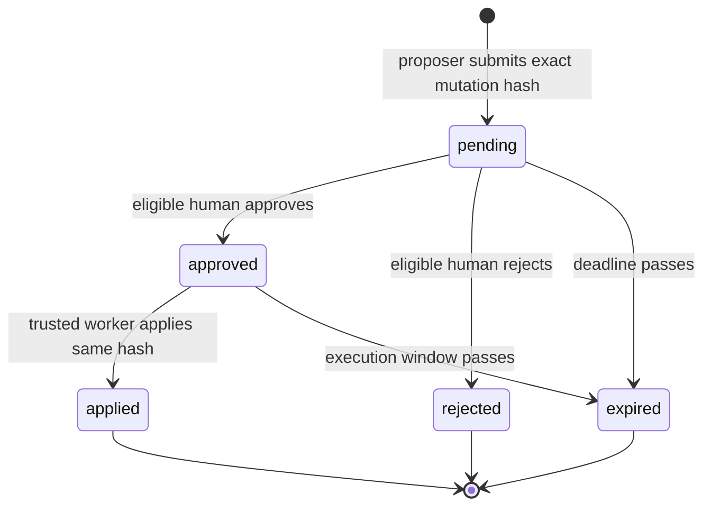

# Security Model

- **Status:** Proposed
- **Last reviewed:** 2026-08-17

## Objective

Limit every operation to the intersection of a verified principal, an authorized MCP
client, a workspace, a named capability, an allowed record state, and a database row.
Compromise of a model or one agent should not become compromise of the Supabase project
or another identity.

This document defines intended controls. It is not a claim that those controls are
implemented.

## Security invariants

1. Public tool execution never uses `service_role`, a Supabase secret key, a project
   access token, or a database role with `BYPASSRLS`.
2. Every external credential is verified for its intended issuer and resource before use.
3. The caller cannot choose an upstream origin, schema, relation, function, or SQL text.
4. Every exposed table or view is deliberately granted and protected by RLS or an
   equivalent database boundary.
5. Authentication alone never grants row access.
6. Identity, workspace, owner, and approval fields are derived from verified context or
   trusted database state, not accepted from model arguments.
7. Read, append, propose, approve, and administer are separate capabilities.
8. Canonical state cannot be changed directly by an agent capability.
9. Trusted audit events cannot be written, modified, or deleted by ordinary principals.
10. Tokens and sensitive record bodies never appear in default logs, errors, metrics, or
    traces.
11. Stored content may influence a model but cannot expand the model's database authority.
12. Unknown, expired, revoked, oversized, or ambiguous input fails closed.

## Principal model

### Human

A Supabase Auth user acting interactively. Stable identity comes from the verified token
subject. Human-readable email or profile metadata is not an authorization key.

### Delegated agent

An MCP client acting for a human. Effective authority is constrained by both the user
subject and OAuth `client_id`; the client is never treated as equivalent to the user in
all contexts.

### Service agent

A durable non-human principal with a named owner, purpose, environment, expiration, and
revocation path. The credential lifecycle is intentionally unresolved until M0 because
the documented Supabase OAuth grant types do not include `client_credentials`.

### Reviewer

A human allowed to approve or reject specified proposal classes. Reviewer permission does
not imply permission to author the proposal or administer principals.

### System worker

A narrowly scoped backend process used for internal maintenance. It is outside the public
MCP tool surface and must have a separately documented credential and policy envelope.

## Authorization dimensions

An allowed action satisfies all applicable dimensions:

```text
allow = authenticated
    AND active_subject
    AND active_client
    AND workspace_membership
    AND capability_grant
    AND tool_contract
    AND row_predicate
    AND operation_predicate
    AND record_state_predicate
    AND assurance_requirement
```

No single JWT role, scope, or table grant is sufficient by itself.

## Proposed capability vocabulary

| Capability | Meaning | Risk class |
| --- | --- | --- |
| `memory:read` | Retrieve an authorized record | Read |
| `memory:search` | Run a bounded authorized search | Read |
| `memory:append` | Add a non-canonical observation | Low write |
| `memory:propose` | Stage a canonical change | Staged write |
| `memory:review` | Approve or reject an eligible proposal | Consequential |
| `memory:apply` | Apply an approved exact mutation | Trusted worker only |
| `audit:read` | Read redacted audit evidence for an authorized scope | Sensitive read |
| `principal:admin` | Provision or revoke principals and grants | Administrative |

Capabilities are additive only when explicitly granted. Wildcards are prohibited in the
initial policy model.

## Authorization data

Authorization decisions must never use Supabase `user_metadata`; users can modify it.

Stable identity uses verified standard claims. OAuth-client identity may use the verified
`client_id` claim. Mutable or rapidly revocable grants live in protected database tables
rather than only in JWT claims, because access tokens can remain stale until refreshed.

Proposed private relations:

- `security.principals`
- `security.workspace_memberships`
- `security.capability_grants`
- `security.client_grants`
- `security.revocations`

Exact schema is an M1 deliverable. Ordinary authenticated callers receive no direct
write access to these relations.

## RLS policy standard

Every exposed relation must satisfy the following review checklist:

- RLS is enabled before a Data API grant is added.
- Policies target explicit roles with `TO`; they do not use deprecated `auth.role()`.
- A policy does more than `TO authenticated`; it contains a subject, membership, or
  capability predicate.
- `UPDATE` has both `USING` and `WITH CHECK` and has the required `SELECT` policy.
- Caller-controlled ownership or tenant columns cannot be reassigned.
- Views use `security_invoker = true` or remain inaccessible to API roles.
- Functions are `SECURITY INVOKER` by default.
- Any justified `SECURITY DEFINER` function is in a private schema, has a fixed empty or
  allowlisted `search_path`, performs an explicit identity check, and has `PUBLIC`
  execution revoked.
- Policy lookup columns are indexed and performance-tested.
- Positive, negative, and cross-identity fixtures exist.

Database table grants and RLS policies are tested separately: grants decide whether the
API role can reach a relation; RLS decides which rows are available after that.

## Canonical mutation protocol

Canonical and irreversible changes use a proposal state machine:



Required properties:

- The proposal stores a canonical representation and cryptographic digest of the exact
  intended mutation.
- Editing the payload invalidates all prior approvals.
- The proposer cannot approve its own proposal unless policy explicitly permits it for a
  named low-risk class.
- Approval is single-use, time-bounded, and transactionally linked to application.
- Agents have no direct policy for the canonical mutation.
- Repeated application returns the original outcome rather than applying twice.

MCP elicitation can improve the human experience, but client UI confirmation is not the
security boundary. Database state is.

## Token and session controls

- Accept bearer tokens only through the transport's authorization mechanism, never query
  strings or tool arguments.
- Validate signature, exact issuer, intended audience/resource, expiry, not-before,
  subject, role, and client identity.
- Cache JWKS only according to safe cache controls and handle signing-key rotation.
- Use short access-token lifetimes appropriate to the deployment.
- Require fresh session validation for selected high-consequence operations if revocation
  latency demands it.
- Do not assume deleting a user immediately invalidates all issued access tokens.
- Require `aal2` for configured high-consequence human review actions.
- Never log access or refresh tokens.

The remote HTTP token chain remains blocked by [ADR-0002](decisions/0002-remote-identity-chain.md).

## Query and exfiltration controls

RLS limits rows but not necessarily cost, aggregation, or data volume. Each tool also
enforces:

- field allowlists;
- maximum filter count and filter grammar;
- opaque, signed, or server-validated pagination cursors;
- maximum rows and response bytes;
- statement and request timeouts;
- embedding-query dimension and input-length limits;
- per-principal and per-client rate limits;
- concurrency limits; and
- redaction of restricted fields before model context.

Search ranking must not leak the existence or count of unauthorized rows.

## Audit model

Two correlated layers are required:

### Operational event

Emitted by the MCP service with request ID, principal ID, client ID, tool version,
normalized argument digest, timestamp, duration, row count, outcome, and denial class.
It excludes tokens, raw authorization headers, embeddings, and sensitive record bodies.

### Trusted data event

Emitted inside the database for consequential mutations with record ID, operation,
actor, client, workspace, proposal/approval IDs, previous and new digests, and correlation
ID. The storage is private and append-only to ordinary principals.

Audit retention, access, and deletion rules must be explicitly configured for the host
application's legal and privacy requirements.

## Security verification

Every milestone runs:

- policy access-matrix tests;
- token-validation negative tests;
- cross-principal and cross-workspace tests;
- input-schema and boundary fuzz tests;
- replay and concurrency tests for writes;
- log and trace secret scanning;
- Supabase security advisors after database changes; and
- adversarial stored-content containment tests.

Production readiness additionally requires an independent security review and a
documented incident/revocation drill.
